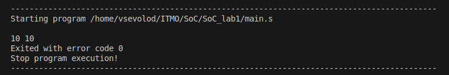
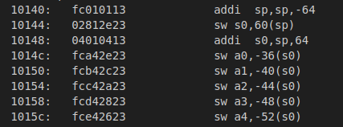
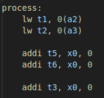
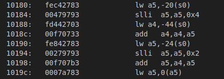
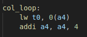
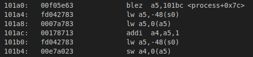
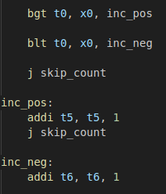

# lab-riscv-asm

## Вариант задания

Определить количество положительных и отрицательных элементов массива. (N = 4, M = 5) 

## Алгоритм решения

По следующему алгоритму была создана программа на языке ассемблера:

1. В регистры передаются аргументы:

    * a2 — адрес N
    * a3 — адрес M
    * a4 — адрес matrix
    * a5 — адрес positive_count
    * a6 — адрес negative_count

2. Внутри функции process:

    * загрузить N и M в t-регистры
    * инициализировать счётчики:
        * t5 = 0 — положительные
        * t6 = 0 — отрицательные
    * организовать двойной цикл:
        * внешний цикл — строки
        * внутренний цикл — элементы строки
    * для каждого элемента:
        * загрузить значение
        * если > 0, увеличить t5
        * если < 0, увеличить t6
    * после завершения циклов сохранить результаты в память

3. В main:

    * загрузить адреса констант и массивов
    * вызвать process
    * вызвать print для вывода двух чисел:
        * positive
        * negative

4. Программа завершает работу через ecall 10.

## Результаты работы

Также данная задача была реализована на языке Си. После компиляции бинарного файла и получения его дампа, у нас будут следующие файлы:

* **main.S** - программа на RISC-V ASM
* **main.c** - программа на Си
* **main.dump** - дамп-файл программы на Си

Далее проверим работоспособность программы, запустив ее в симуляторе. Я буду использовать расширение для VSCode Venus Simulator. В нашу программу будем передавать матрицу следующего вида:
```
  1,  -2,  3,  -4
 -5,   6, -7,   8
  9, -10,  1,  -2
  3,   4, -5,  -6
 -7,  -8,  9,  10
```

Запускаем код в симуляторе и получаем следующий вывод:



Как мы можем увидеть, программа работает верно. Далее я решил сравнить свою реализацию с реализацией компилятора/ Вот основные различия, которые я обнаружил:
* компилятор создает стек-фрейм для хранения аргументов, а я использую временные переменные

    
* компилятор вычисляет адреса матрицы с помощью slli, а я подряд итерировал элементы матрицы

    
* компилятор использовал немного другие команды перехода и сохранял значения счетчиков для результата сразу, в отличии от моего решения 

    

## Сборка
Для сборки программы на Си и получения dump-файла необходимо последовательно ввести две команды:
```bash
riscv64-unknown-elf-gcc -march=rv32i -mabi=ilp32 main.c -o main.elf
riscv64-unknown-elf-objdump -D main.elf > main.dump
```

Чтобы запустить код на ассемблере, необходимо скачать расширение-симулятор Venus для VSCode или воспользоваться онлайн-симулятором.